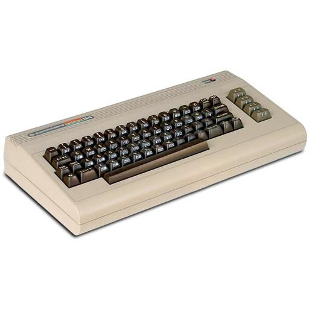

# Commodore - C64 (Frodo)

### Description

Frodo is a free and portable emulator for the Commodore 64, an 8-bit home computer introduced in 1982 by Commodore International.

### License

GPLv2

### Icon

### Fanart

Help make me fanart!

### Screenshots

Help make me screenshots!
